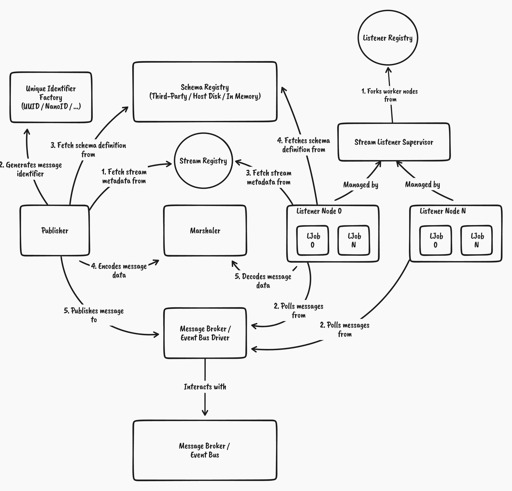

# :envelope: Streamhub

[][godocs]

[![Coverage Status][cov-img]][cov]
[![Go Version][go-img]][go]

`Streamhub` is a toolkit crafted for streaming-powered applications written in Go.

- [:envelope: Streamhub](#envelope-streamhub)
  - [Requirements](#requirements)
  - [Overall Architecture](#overall-architecture)
    - [Message](#message)
    - [Stream Registry](#stream-registry)
    - [Unique Identifier Factory](#unique-identifier-factory)
    - [Schema Registry](#schema-registry)
    - [Marshaler](#marshaler)
    - [Message Broker / Event Bus Driver](#message-broker--event-bus-driver)
    - [Publisher](#publisher)
    - [Listener Registry](#listener-registry)
    - [Listener Supervisor](#listener-supervisor)
    - [Listener Node](#listener-node)
    - [Listener / ListenerFunc](#listener--listenerfunc)
  - [Supported infrastructure](#supported-infrastructure)

## Requirements
- Go version >= 1.17

## Overall Architecture

`Streamhub` is composed by several inner components which collaborate with each other in order to accomplish basic 
streaming handling operations (_publishing and consuming messages_).

Streamhub exposes all its operational capabilities through a simple and idiomatic API, enabling interactions between the program
and the actual live infrastructure using a _facade component_ called `Hub`.

_Internal `Hub` architecture and specific flows of basic streams operations. 
On the left: Message publishing flow. On the right: Message consumption flow._

### Message

The `Message` type is the unit of information which will be used to interact with multiple systems through live infrastructure.

`Streamhub` implements natively most of the CNCF's `CloudEvents` specification fields to keep consistency between messages passed through
a stream.

Just as the `CloudEvents` specification states, depending on the underlying communication protocol from Event Buses and 
Message Brokers (_e.g. MQTT, Apache Kafka, raw JSON, Amazon SNS_), a message will be constructed accordingly to the given protocol.

For example, if using Apache Kafka, most of the message fields will be attached to binary headers instead the body of the 
message itself. In the other hand, if using Amazon Simple Notification Service, messages will be encoded into the raw
JSON template for messages as AWS specifies on their API definition for SNS. These processes are independent from the `Marshaler`
operations. Hence, message inner data (_the actual message content_) codec won't change.

For more information about CloudEvents, please review this [repository](https://github.com/cloudevents/spec).

### Stream Registry

An `Stream Registry` is an in-memory key-value database used by both `Listener Node(s)` and `Publisher` which holds metadata about every stream
that will interact with the program.

Moreover, stream metadata might contain critical information about the stream such 
as the name of the stream (_also called topic_), schema definition version and/or the schema definition name so components such as `Publisher` and `Listener Node` can find schema definitions
from the `Schema Registry` in order to continue with their further operations normally. The stream name defined here is used
by both `Publisher` and `Listener Node(s)` to interact with live infrastructure.

The `Stream Registry` accepts reflection-based structs which will lead to a registration with the given struct name 
(_e.g. package_name.struct_name -> main.fooMessage_) as string. In addition, the registry also accepts plain strings as 
keys in order to increase flexibility (_one may use the stream name, e.g. foo-stream_).

Note: If using plain strings as keys, remember to fulfill the `GoType` metadata field so the `Listener Node` handler can decode
the incoming message data. If no `GoType` was found in stream metadata while consuming a message, the marshaling capabilities will be
disabled to avoid program panics.

Note: Using reflection-based stream definitions will lead to performance degradation when listening to streams. 

### Unique Identifier Factory

A `Unique Identifier Factory` is a component which generates unique identifiers using an underlying concrete implementation
of a unique identifier algorithm (_e.g. UUID, NanoID_). It is used by the `Publisher` component to construct unique messages.

### Schema Registry

An `Schema Registry` is a database which holds messages schema definitions and versioning. It ensures that every message produced
and consumed by the program complies with the specified schema definition.

The registry MIGHT be implemented using either external or internal underlying solutions (_e.g. Third-Party service such 
as Amazon Glue, Host's disk or In-memory_).

Note: For Apache Avro message formats, the usage of an `Schema Registry` is a MUST in order for the `Marshaler` component
to decode and encode message data.

### Marshaler

A `Marshaler` is a component in charge of message data coding and encoding.

Currently, `Streamhub` has _Apache Avro_ and _JSON_ native implementations. Nevertheless, the `Marshaler` interface is exported through `Streamhub`
API to give flexibility to developers as it lets custom `Marshaler` implementations.

We are currently considering adding `Protocol-Buffers` and `Flat/Flex Buffers` codecs for edge cases where greater 
performance is required.

### Message Broker / Event Bus Driver

The Message Broker / Event Bus `Driver` is an abstract component which enables interactions between `Hub` internal components
and the actual stream-messaging live infrastructure (_e.g. Apache Kafka, Amazon SNS/SQS, In-memory_).

The driver component implements both `Publisher` and `Listener Node` interfaces. Thus, by separating behaviours through interfaces,
technology heterogeneity and autonomy between processes is achieved, giving the program even greater flexibility of interaction.

For example, the program might contain a Hub which publishes messages to Amazon Simple Notification Service (SNS) while one 
set of Listener Nodes polls messages from Amazon Simple Queue Service (SQS) queues and another set of Listener Nodes receive
messages from Apache Kafka topics.

### Publisher

A `Publisher` is a high-level component that lets the program publish messages to desired streams defined on the message
broker / event bus, so external programs may react to published messages in parallel.

Furthermore, the publisher API is designed to allow chain of responsibility pattern implementations (_middlewares_) in order
to aggregate extra behaviours when publishing messages (_e.g. logging, tracing, monitoring, retries_).

`Streamhub` offers native implementations through the use of a `Driver`. Nevertheless, custom `Publisher` implementations
crafted by developers are available as `Streamhub` API exposes the publisher interface.

### Listener Registry

A `Stream Listener Registry` is an in-memory database which holds information about workers to be scheduled when `Hub` gets started.

Workers are also called `Listener Node`.

### Listener Supervisor

The `Listener Supervisor` is an internal `Hub` component which manages `Listener Node(s)` lifecycles.

It forks new workers into the `Listener Registry` queue, and it schedules workers on `Hub` startup.

In addition, when forking new workers, the supervisor crafts a `Listener Task` template, using the listener node configuration, which will be later passed to `Driver`
listener node interface implementations on `Hub` startup. This template is used internally by drivers to access critical data so they can 
interact with live infrastructure (e.g. Stream / Topic name, Consumer Groups / Queues to be used, Vendor-specific configurations such as Amazon Web Services or Shopify's Sarama lib for 
Apache Kafka).

### Listener Node

A `Listener Node` is an internal `Listener Supervisor` component which schedules actual stream-listening jobs. These 
stream-listening jobs are mostly I/O blocking so the node will try to run then concurrently if a degree of parallelism was
configured for the worker.

It uses the `Driver` listener node interface implementation to interact with live infrastructure.

Note: In order to stop `Listener Node` inner processes, a context cancellation MUST be issued through the root `Context`
passed originally on `Hub` startup. Moreover, every node job has an internal _timeout_ context constructed from the root context
in order to avoid stream-listener jobs hang up or considerable wait times, affecting throughput directly.

Note: Every `Listener Node` inner process runs inside a new goroutine and uses a timeout scoped context to keep process 
autonomy and increase overall throughput.

### Listener / ListenerFunc

Each `Listener Node` contains a specific-configuration as previously mentioned. This configuration holds, asides from critical data for `Driver`
implementations, `Listener` and `ListenerFunc` interface/type which represent the entry point for desired message processing
operations defined by the developer (the handler for each message received from a queue/topic).

These types/interfaces lets programs to return an error if something failed when processing the message. If no error was returned,
the `Driver` implementation will acknowledge the message to the actual live infrastructure to avoid message re-processing issues.
As side note and recommendation, remember to keep message processors idempotent to deal with the nature of distributed systems
(_duplicated and un-ordered messages_).

Moreover, the `Listener` and `ListenerFunc` types/interfaces APIs were defined to enable chain of responsibility pattern 
implementations (_middlewares_), just as the `Publisher` API, to let developers add layers of extra behaviour when
processing a message.

It is required to say that `Streamhub` adds layers of behaviour by default for every `Listener`/`ListenerFunc` forked.
These behaviours include:

- Exponential backoff retrying (_fully customizable_)
- Correlation and Causation IDs injection into the handler-scoped context
- Unmarshaling*
- Logging*
- Monitoring/Metrics*
- Tracing*

_* Available if properly configured_

## Supported infrastructure

- Apache Kafka (on-premise, Confluent cloud or Amazon Managed Streaming for Apache Kafka/MSK)
- Amazon Simple Notification Service (SNS) and Simple Queue Service (SQS) with the [Topic-Queue chaining pattern](https://aws.amazon.com/blogs/compute/application-integration-patterns-for-microservices-fan-out-strategies/) implementation
- Apache Pulsar*
- MQTT-based buses/brokers (e.g. RabbitMQ, Apache ActiveMQ)*
- Google Cloud PubSub*
- Microsoft Azure Service Bus*
- Redis Streams*

_* On Streamhub's roadmap, not yet implemented._

[actions]: https://github.com/neutrinocorp/streamhub/workflows/Testing/badge.svg?branch=master
[godocs]: https://pkg.go.dev/github.com/neutrinocorp/streamhub
[cov-img]: https://codecov.io/gh/NeutrinoCorp/streamhub/branch/master/graph/badge.svg
[cov]: https://codecov.io/gh/NeutrinoCorp/streamhub
[go-img]: https://img.shields.io/github/go-mod/go-version/NeutrinoCorp/streamhub?style=square
[go]: https://github.com/NeutrinoCorp/streamhub/blob/master/go.mod
[examples]: https://github.com/neutrinocorp/streamhub/tree/master/examples
